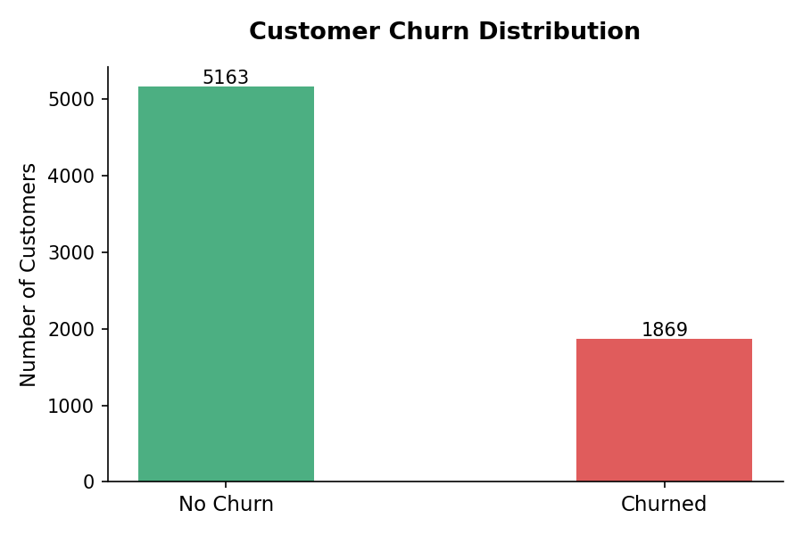
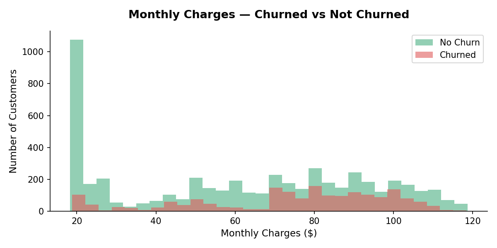
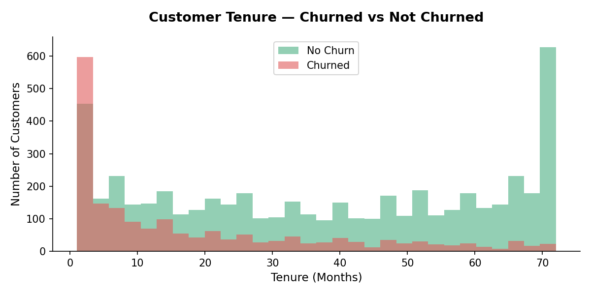
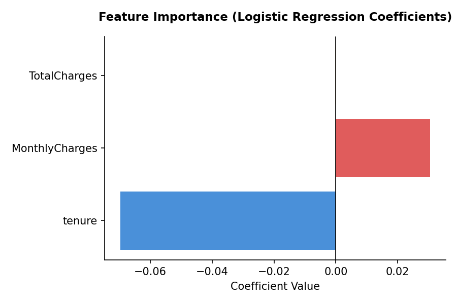

# Customer Churn Prediction

A Python-based machine learning project to predict customer churn using logistic regression.

## What it does
- Loads and cleans 7,000+ customer records from a telecom dataset
- Explores churn patterns by monthly charges and tenure
- Trains a logistic regression model to predict churn
- Produces 4 charts showing churn distribution, charges, tenure, and feature importance

## Tools Used
- Python (Pandas, Matplotlib, Scikit-learn)
- Dataset: Telco Customer Churn (Kaggle)

## Model Result
- Accuracy: 80%

## Charts

